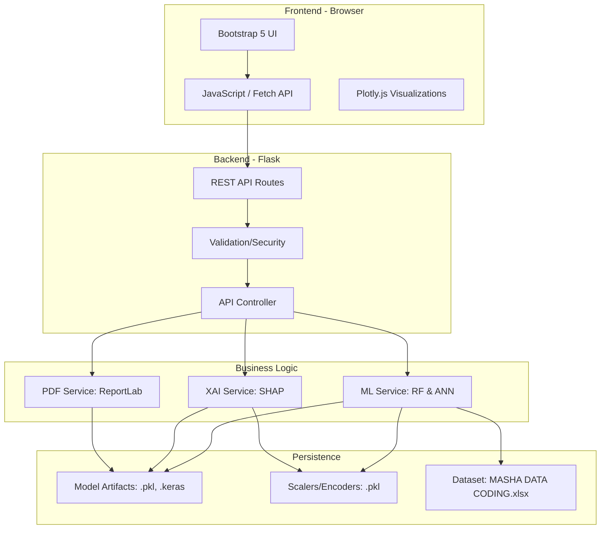

# System Architecture Diagram

```mermaid
graph TD
    subgraph Frontend_Layer [Frontend - Browser]
        UI[Bootstrap 5 UI]
        JS[JavaScript / Fetch API]
        PL[Plotly.js Visualizations]
    end

    subgraph API_Layer [Backend - Flask]
        Route[REST API Routes]
        Auth[Validation/Security]
        Ctrl[API Controller]
    end

    subgraph Service_Layer [Business Logic]
        ML[ML Service: RF & ANN]
        XAI[XAI Service: SHAP]
        PDF[PDF Service: ReportLab]
    end

    subgraph Data_Layer [Persistence]
        Models[Model Artifacts: .pkl, .keras]
        Scaler[Scalers/Encoders: .pkl]
        Dataset[Dataset: MASHA DATA CODING.xlsx]
    end

    UI --> JS
    JS --> Route
    Route --> Auth
    Auth --> Ctrl
    Ctrl --> ML
    Ctrl --> XAI
    Ctrl --> PDF
    ML --> Models
    ML --> Scaler
    ML --> Dataset
    XAI --> Models
    XAI --> Scaler
    PDF --> Models
```
