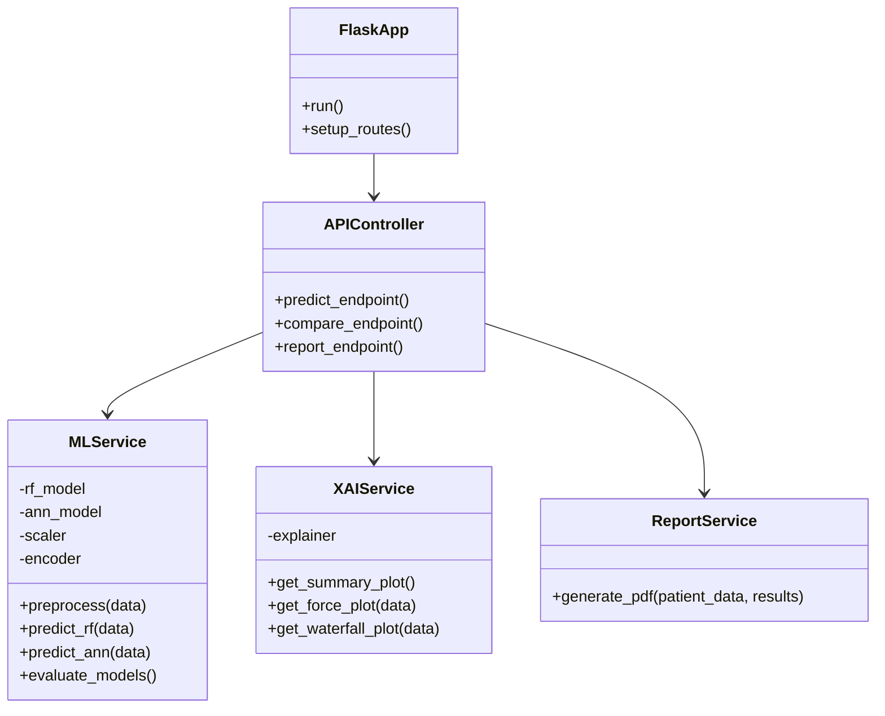

# Class Diagram

```mermaid
classDiagram
    class FlaskApp {
        +run()
        +setup_routes()
    }

    class MLService {
        -rf_model
        -ann_model
        -scaler
        -encoder
        +preprocess(data)
        +predict_rf(data)
        +predict_ann(data)
        +evaluate_models()
    }

    class XAIService {
        -explainer
        +get_summary_plot()
        +get_force_plot(data)
        +get_waterfall_plot(data)
    }

    class ReportService {
        +generate_pdf(patient_data, results)
    }

    class APIController {
        +predict_endpoint()
        +compare_endpoint()
        +report_endpoint()
    }

    FlaskApp --> APIController
    APIController --> MLService
    APIController --> XAIService
    APIController --> ReportService
```
