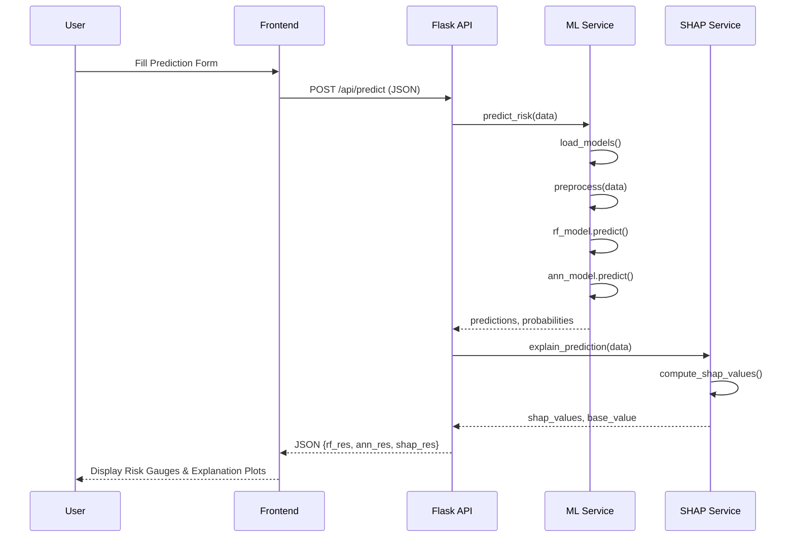

# Sequence Diagram (Prediction Process)

```mermaid
sequenceDiagram
    participant User
    participant Frontend
    participant API as Flask API
    participant ML as ML Service
    participant XAI as SHAP Service

    User->>Frontend: Fill Prediction Form
    Frontend->>API: POST /api/predict (JSON)
    API->>ML: predict_risk(data)
    ML->>ML: load_models()
    ML->>ML: preprocess(data)
    ML->>ML: rf_model.predict()
    ML->>ML: ann_model.predict()
    ML-->>API: predictions, probabilities
    API->>XAI: explain_prediction(data)
    XAI->>XAI: compute_shap_values()
    XAI-->>API: shap_values, base_value
    API-->>Frontend: JSON {rf_res, ann_res, shap_res}
    Frontend-->>User: Display Risk Gauges & Explanation Plots
```
